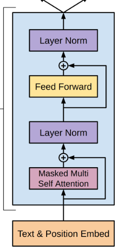
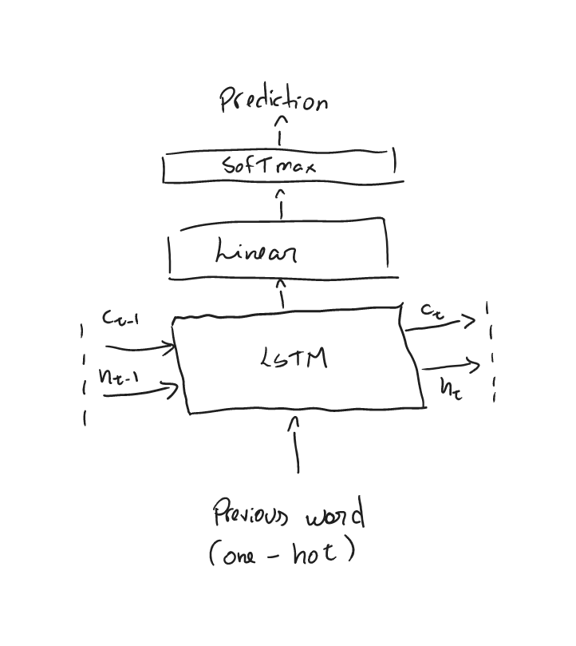
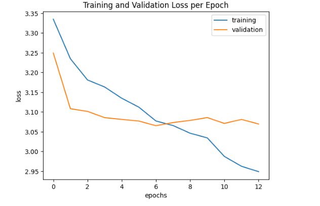
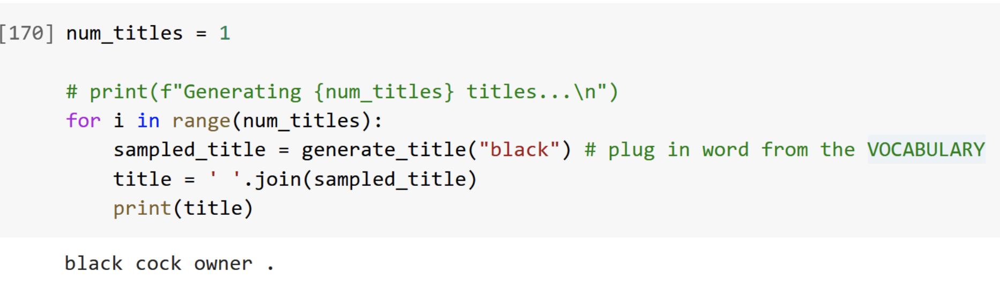

<h1>Bedtime Story Completion Model</h1>
<h3>CSC413 - Neural Networks & Deep Learning Final Project</h3>

## Running the Project

- We have included the code which loads the final trained models and generates results in a file called `final.ipynb`. You can run the code in the following google collab:

  > https://colab.research.google.com/drive/1doRR2Nh--ooMe-2js0yKwtGhU9BDygvF?usp=sharing

- This repo contains the full implementation of the project in the following structure:

  `clean.py:` The code that clean the data set used to train the models (for more information on the dataset and how to download it please see _the Data section_.)

  `storygeneratorfinal.ipynb:` The code used to train and structure the data for the GPT-2 model which generates the bedtime story

  `lstm_model.py:` The code used to train and structure the data for the RNN model which generates the title of the bedtime story

  `final.py:` The code that prompts the user to use the program and write share the beginning of the story. This file connects both models as generates a bedtime story and generates a title based on the generated bedtime story.

## Introduction

We created two models to aid writers with creating short bedtime stories.

- A short-story generator: A model that takes the start of a short story and continues the story.
- A title generator: A sequence-to-sequence model that generates a bedtime story title.

The two models can be used together in an application to help writers overcome writer's block and improve their speed of writing short bedtime stories.

For the short-story generation, we fine-tuned a pre-trained GPT-2 model.
For the title generation, we trained an RNN model from scratch. Both were trained on a dataset comprised of childrens' books. Therefore, we present our model in the context of generating this type of story --- though we believe that the architecture employed should be similarly useful for other domains.

## Model Figure

#### **GPT2 model:**

GPT-2 is primarily comprised of a sequence of transformer blocks, each employing (masked) multi-headed attention ([Improving Language Understanding by Generative Pre-Training](https://cdn.openai.com/research-covers/language-unsupervised/language_understanding_paper.pdf)), with multiple normalization layers at the beginning of each block, plus one normalization layer at the end of the transformer stack ([Language Models are Unsupervised Multitask Learners](https://cdn.openai.com/better-language-models/language_models_are_unsupervised_multitask_learners.pdf)). The exact number and size of these blocks depends on the size of model used (see "Model Parameters" below). Note the GPT architecture is decoder-only.

Diagram of a decoder-only transfomer block (from Improving Language Understanding by Generative Pre-Training):



Inputs are represented as tokens, though the relationship between words and tokens is not one-to-one (see "Data Transformation" below for more details). Of note, the transformer sequence is preceded by an encoder which encodes these tokens and applies positional encoding. When carrying out text generation, the transfomer sequence is followed by a linear modelling head, which is a "linear layer with weights tied to the input embeddings" ([Documentation](https://huggingface.co/docs/transformers/model_doc/gpt2))

#### **RNN model:**

RNN with LSTM cell can be broken down into four main components: the input layer, the LSTM layer, the linear layer and the output layer with the softmax activation. The LSTM layer consists of a series of LSTM cells that process the input sequence in a sequential manner. Each LSTM cell has three main components: the input gate, the forget gate, and the output gate. These gates control the flow of information in and out of the cell, allowing the LSTM to selectively remember or forget information from previous time steps. The output layer of an RNN with LSTM cell receives the final hidden state output from the LSTM layer and produces the final output for the sequence.



## Model Parameters

#### **GPT2 Model:**

Due to compute limitations, we present our results based on our use of the smallest GPT2 instance, which has approximately 117 \* 1024^2 parameters (117M) ([Language Models are Unsupervised Multitask Learners](https://cdn.openai.com/better-language-models/language_models_are_unsupervised_multitask_learners.pdf)), laid out across 12 layers (i.e. 12 transformer blocks), whose inputs and outputs are 768-dimensional. The attention layers work with 1024 token context lengths and have 12 heads. The feed-forward layers work with dimension 3072 (as in GPT1).

In particular, we have the following parameter counts:

For the input embedding layer, we have 38597376 parameters. This corresponds to 50257, the vocab size, times 768, the embedding dimensionality.

For the positional embedding, we have 786432 parameters. This corresponds to 1024, the positional embedding size, times 768, the embedding dimensionality.

For the transformer stack, we have 12 transfomer layers, each with one self-attention layer, one feed-forward layer, and one normalization layer:

- The normalization layer has a relatively negligible 1536 parameters (twice the embedding dimension for the two distribution parameters each).
- For the self-attention layer, we have approximately 4 \* (768^2) parameters, corresponding to a linear output (768^2 matrix), and multiple Q, K, V matrices (12 heads \* 3 matrices each in total, each matrix having 768 \* (768/12) parameters --- notice here that the outputs for these is divided by the head count, which ensures concatenating the attentions will result in a 768-dimensional vector). Refere to the source below for more details (and the exact formula, if desired).
- For the feed-forward layer, there are two linear layers that start with the 768-dimensional embedding, grow it to 3072 dimensions, apply ReLU, and then bring it back to a 768-dimensional embedding. This corresponds to a total parameter count of (768 \* 3072 + 3072) + (768 \* 3072 + 768) (matrix weights and biases).

In total this yields approximately `4 * (768^2) + 1536 + (768 * 3072 + 3072) + (768 * 3072 + 768)` parameters per layer times 12 layers, or almost 85 million parameters --- not the exact value of 85054464 since we neglected a few biases in our calculation above for simplicity --- but very close.

(See [How to Estimate the Number of Parameters in Transformer models](https://towardsdatascience.com/how-to-estimate-the-number-of-parameters-in-transformer-models-ca0f57d8dff0) for details on this calculation)

The last normalization layer `ln_f` has a relatively negligible 1536 parameters (which is two times the embedding dimension)

Note that the language modelling head has weights tied to the input embedding, so it does not add to our parameter count.

#### **RNN Model:**

In the case of our LSTM model we need to look at the input, output and the layers of our model to get the total number parameters.
To get a better idea the input is a one-hot tensor with the size of the vocabulary because each "slot" represents a word of the vocabulary,
the output is represented in the same way so it is correct to say that both the input and the output are the size of the vocabulary (2111, since there are 2111 words in the vocabulary).
Also, we must account for the number of parameters in each LSTM cell which has four gates: the input, output, forget and cell gate.
Therefore we have a factor of 4 for the lstm cell and for the hidden state lstm cell.

So for the LSTM layer, the number of parameters is calculated as:
`4 * ((input_size + hidden_size) * hidden_size) + 4 * hidden_size`
`= 4 * ((2111 + hidden_size) * hidden_size) + 4 * hidden_size`
where input_size is the size of the input vocabulary, and hidden_size is the size of weights and biases for the LSTM.

For the Linear layer, the number of parameters is calculated as:
`(hidden_size * output_size) + output_size`
`= (hidden_size * 2111) + 2111`
Note that in the case of the Linear layer the output_size is the size of the output vocabulary and the size of weights and biases for the Linear layer.

Also note that hidden_size is a hyperpameter so by knowing its value we can compute the total number of parameters which is the sum of the parameters for the LSTM layer and the Linear Layer.
In the case of our model we set the hidden_size to be 128 .
So the total parameters for the RNN model layer given the value of the hidden_size is:
`total params in LSTM layer + total params in Linear layer`
`[4 * ((2111 + hidden_size) * hidden_size) + 4 * hidden_size] + [(hidden_size * 2111) + 2111]`
`= [4 * ((2111 + 128) * 128) + 4 * 128] + [(128 * 2111) + 211]`
`= 1417299`

Therefore RNN model has ~1417299 total parameters.

## Model Examples

#### **GPT2 Model:**

_Successful story generated:_

Prompt: Laura was searching for a prince

Story:

> Laura was searching for a prince when she found her in a swamp.
> He was a dragon, a warrior, and a king. The dragon was an evil one, and she was a witch, a witch's child.
> She wanted to take over the kingdom, and the dragon didn't have a good reason to do so.
> But the dragon was just one of many dragons, and she could not be blamed for her evil ways.
> She was the only one that could stop the evil from coming.
> But then the dragon fell, and she was left with a dragon. And the dragon wasn't the only one that had fallen.
> The king was the one that had tried to take over the kingdom, and he was right there in the middle of the swamp.
> He was the one who had brought the dragon to the swamp, and she had been trying to take over the kingdom. She was wrong. She had been wrong.
> And she had been wrong again.

_Unsuccessful story generated_

Prompt: Mateus loves playing with his magical AI model

Story:

> Mateus loves playing with his magical AI model of human-like features and looks as though it has found the right balance between his skill and his natural ability. He is able to move freely on all four limbs, even his head, while in his head the rest of the body is entirely unplumbed. When he is feeling tired or tired, he can hold his head in one hand while his right hand rests on his arm. At night, he sleeps in his bed, in the

This example suggests the model still struggles generating coherent stories starting from words that are outside it's training set.

#### **RNN Model:**

The following titles were generated with the `sequence_length = 4` as hyperparameter.
After the model was trained, we used the `max_title_length = 5` and set the first word for the titles to be "white".

_Successful story title generated:_

> white december .

_Unsuccessful story title generated:_

> white on representative "venetia henny

The first title is considered successful since it is concise, logical and descriptive. It also hints at the idea of snowy winter and the there are no syntactical grammar issues.
The second title is considered unsuccessful since it lacks meaning and it is confusing. it has quotes in the middle of the title and the order for adjectives and nouns is unantural.

To share more in depth results, these are <u>examples of the titles in contrast</u> with the generated stories.

_Successful story title generated:_

Prompt: The winter was approaching

Title: WIND LAID

Story:

> The winter was approaching, the sun was setting, and I saw the wind whipping and twisting and twisting my limbs and the soft clods that hung on my feet and the tangled bits of wood that clung to my feet, all around me. I was Boolean, but my mind had no idea how to begin to move in the first place. The wind had already begun to move, and my legs were tired of clinging to each other as they pulled away from the branches and into the snow. The

In this case the title seems to match the story well because the story mainly talks about the WIND and the wind seems to be described as LAID just like the narrator who is laying and seems to be unable to move.

**Unsuccessful story title generated:**

Prompt: The winter was approaching

Title: SNOW CHARTER SLUGGARDS INN KINGFISHER .

Story:

> The winter was approaching, and I had no idea why I was so frightened, for the snow was so thick, and there was so much snow, and the snow was so dense. I felt so frightened and alone, that I did not think how to get up, or go home. The wind was so strong, and the earth so rough, that I had no way out, and the only way was to go up and out again. When I was ready, I went up and out again

In this case the title in unsuccesful. Even though the title mentions snow which is mostly mentioned in the story, the rest of the title has nothing to do with the story and even lacks meaning on its own.

## Data

We used the children stories text corpus data set, available on https://www.kaggle.com/datasets/edenbd/children-stories-text-corpus. This data set is a collection of children books collected from Project Gutenberg. Project Gutenberg aims to encourage the distribution of eBooks by sharing books or stories that are in the public domain, meaning there are no intellectual property right over the data. The Kaggle dataset is similarly under the public domain (Creative Commons license) waiving rights to copyright law. Hence we have permission to use the data.

Since the data is a collection of short stories, it is ideal for text generation. The dataset consists of 20.6 MB of English text. This is sufficient for our purposes as we are starting with the GPT-2 model, so we only need to fine-tune the model for the dataset. As for title generation, the dataset contains the titles of all the stories, so we can use that for training and evaluation.

The dataset consists of around 1000 stories, with an average story length of around 3014 words. There are a total of 3,792,498 words, with 151,964 unique words. There are 19,304 question marks, 23,270 exclamation marks, 179,871 periods, and 309,764 commas. The top 5 most common words along with their frequencies are "the" (209,801), "and" (139,615), "to" (99,378), "of" (85,344), and 'a' (79,847).

Snippet of a short story in the dataset. Overall length is 411 words:

    THE REAL PRINCESS
    There was once a Prince who wished to marry a Princess; but then she must be a real Princess. He travelled all over the world in hopes of finding such a lady; \textbf{[...]} The Prince accordingly made her his wife; being now convinced that he had found a real Princess. The three peas were however put into the cabinet of curiosities, where they are still to be seen, provided they are not lost.
    Wasn't this a lady of real delicacy?

## Data Transformations

The initial data consisted of a single text file where the titles and stories were not distinctly separated. To make the data usable for our project objectives, we required it to be organized in a structured manner. Consequently, we converted the text file data into a dictionary format, where the titles served as the keys and the stories as the corresponding values. Please refer to the "clean_data" function for further details.

For the story completion model, we use a pre-trained GPT2 text encoder, which encodes the text using Byte-Pair Encoding (BPE). We also restrict the length of the resulting sequence,
given that GPT2 has a limited context length, which is possibly exceeded by some of the
stories.

For the title generator, we use a naive bag-of-words encoder. This has the limitation that the model cannot produce titles using words not seen in the training set.

## Data Split

For the **GPT-2 model**, we did a 70-10-20 split. 70% of the data was the training set, 10% of the data was the validation set, and 20% of the data was the testing set. This is a fairly standard split. We decided to place more data into the testing set (20%) in contrast to validation because we run validation at each epoch, and the process was fairly time consuming. Testing in contrast is done only once, after the model is trained.

In the case of the **RNN model**, we did not split the data as we wanted to make the most out of the titles of all the stories and give our model the opportunity to be as exposed as different types of word sequences upon training, considering that the prompt could be anything and that the story that GPT-2 generated would likely have way more diverse words then the vocabulary of titles in the dataset.

## Training Curve

#### **GPT2 Model:**

The training and validation curves for the GPT-2 model are shown below. We have attempted to train the model for 12 epochs. In the first 6 epochs, both the training loss and the validation loss have steadily decreased. However, after 6 epochs the validation loss started increasing which suggests that the model started overfitting. While training, we have saved a checkpoint for the model with the lowest total validation loss to avoid overfitting.



#### **RNN Model:**

Below is the training loss curve generated in lstm_model.py. The plot was generated by conducting 1100000 iterations of training and graphing the resulting loss at intervals of 1000 iterations. The hyperparameters used for training the model were as follows:

- `learning_rate` = 0.005
- `n_hidden` = 128
- `sequence_length` = 4


_Note that in the figure above, the y-axis represents the loss and the x-axis represents the number of iterations._

## Hyperparameter Tuning

#### **GPT2 Model:**

There are a number of hyperparameters for the GPT-2 model, and we have experimented with different combinations of these. Here are our results:

- Batch Size. Number of samples used in a pass. Due to the large number of parameters GPT-2, we were limited to small batch sizes (4 or below). These batch sizes did not make a significant difference.
- Epochs. We found that there was no benefit to a large number of epochs. After 2 epochs, the validation loss remained steady and did not decrease further.
- Learning rate. At first, we tried an approach of using a using a [linear scheduler with warmup](https://huggingface.co/docs/transformers/main_classes/optimizer_schedules) scheduler to change the learning. We found that using this approach, regardless of the learning rate we set, we would have the loss decrease for 2 iterations and then remain steady. This was a major issue as the model was not learning enough from the dataset. Taking out the scheduler fixed this problem and improved the quality of the stories.
- max_seq_len: The maximum length of a sequence, the amount of context we could capture. We could only go up to 400 without running into out of memory errors. This also means that the model tends to lose context when prompted to generate longer stories. We found that when promopted to generate long stories, the model tends to start repeating words over and over.

#### **RNN Model:**

1. Tune `sequence_length`.

The length of the sequence is a hyperparameter. The model was trained with the three values of `sequence_length`:

- `sequence_length = 3`
  Sample titles output:

```
real are .
year blackfeet cudred on how the how all his his pipes saw
are anything to seeing food wife xi white hump cobbler’s learn learn
tuk .
godmother ix .
```

- `sequence_length = 4`
  Sample titles output:

```
teeny frank .
strangest frost .
stolen xii .
publishers midsummer .
clever delight .
```

- `sequence_length = 5`
  Sample titles output:

```
show fed pack himself himself .
hogshead cyclone n debarred discovered .
period orphant magic world .
balloon appears lead himself .
boscombe tail r s wen .
```

From the analysis of multiple output blocks, `sequence_length = 4` is the better hyperparameter choice because we get more consistent titles in terms of sentence structure and correct context.

2. Tune `learning_rate`.

The learning rate is a hyperparameter. The model was trained with the two values of `learning_rate`:

- `learning_rate = 0.05`
  Sample titles output:

```
.
midsummer gideon woman huslo awl awl the .
mount .
red .
.
```

- `learning_rate = 0.005`
  Sample titles output:

```
teeny frank .
strangest frost .
stolen xii .
publishers midsummer .
clever delight .
```

From the analysis of multiple output blocks, `learning_rate = 0.005` is the better hyperparameter choice as the sentences were more consistent in length. Not too long or too short and overall there were less syntactical issues.

## Quantitative Measures

First, for both models we used the loss to measure the progress the models make while training.

In addition, for the **GPT-2 model** we investigated a few different quantitative methods of measuring our model on the final testing set. We examined BLEU, ROUGE, and BERTScore.
We originally planned to use BLEU as our metric since it is a very widespread metric that measures similarity between two texts. The metric was first proposed in a 2002 [paper](https://aclanthology.org/P02-1040.pdf?ref=blog.paperspace.com) for automatic evaluation of machine translation. However, after experimenting with this metric we found that it does not make sense for our task. While BLEU measures how good the quality of a machine-generated translation is, writing short-stories is more of a creative task. The continuations of short-stories can be surprising and unusual - they are not a a translation task.
Instead, we decide to use ROGUE. ROGUE stands for Recall-Oriented Understudy for Gisting Evaluation. Specifically, we used ROUGE-N, which measures the overlap of n-grams. We found ROGUE superior because it is better at measuring whether the text matches the context, rather than attempting to just measure the text as a translation.

## Quantitative and Qualitative Results

#### GPT2 Model:

ROGUE is measured on a scale of 0 to 1, with 0 indicating poor similarity and 1 indicating essentially identical text. We obtained a ROGUE score of 0.71, which is a good score for the task.  
We have also reduced the training loss from 3.34 to 2.95, and we reduced the validation loss from 3.25 to 3.04.
In addition, as we showed in the model examples, our model managed to create coherent story examples.

#### RNN Model:

In the case of the title generation we get the following sampled titles with a sequence_length = 3:

```
indian dickon tea .
penny maleen .
norroway paris .
herdsman discontented .
real are .
year blackfeet cudred on how the how all his his pipes saw
are anything to seeing food wife xi white hump cobbler’s learn learn
anne cudred .
tuk .
godmother ix .
goat imagine criticism .
chap couch .
claus to peace strife d london george .
tobacco wen .
bad jolly on are were x all how in in sorrow tempests
```

We get the following sampled titles with a sequence_length = 4:

**Sample 1**

```
riding among war .
allowed fable .
scuttle stag .
rest shuttle .
closing moore iv .
know when hood your question ruler oh out and began borrow began
walk tash .
santa bear .
leaves hill .
stork march .
sack girl .
angels .
vanity leyden .
beeches ode iv .
midsummer .
```

**Sample 2**

```
mate sparrow .
strangest frost .
stolen xii .
much huntsman actors .
publishers midsummer .
jackdaw sir .
proserpine knowall lip .
harm maid .
mole fine .
child heidelberg .
teeny frank .
clever delight .
inferior coronet history .
feeler luck .
meets iv .
```

We get the following sampled titles with a sequence_length = 5:

**Sample 1**

```
show fed pack himself himself .
hogshead cyclone n debarred discovered .
period orphant magic world .
balloon appears lead himself .
boscombe tail r s wen .
youth right he command was who if the the get ready one’s
vampire .
balloon understand thought peace pieces .
ball kindness experiments nail discovered .
u tobacco .
chorus slipper .
rowland woodman king’s do readily .
harpies beautiful pilgrims tears’ .
prevented guard do under himself .
play shadow ramhah .
```

**Sample 2**

```
bye power .
age seasons witch publishers .
right river witch was he he not not not not not not
remain belt .
famine wives secret .
period punch .
jack bennett .
impressions out chapter i escape .
suds miacca .
happy kingfisher .
mountain kangaroo away other oldtown .
runs bright wait vi himself .
china coffin jewels he know must .
plain brook tobacco beth .
eggs land childish readily escape i .
```

## Justification of Results

### **GPT-2 Model**

Overall, we are happy with the performance of the GPT-2 model.

- When we started out, our default hyperparameter choices for the model did not generalize much and we could not fine-tune the model to short stories. However, after tuning the hyperparameters we were able to improve the quality of the stories. This was both evident in an improvement to the quality of the generated stories and an improved BLEU score for our test set.
- After our initial failed attempts, we had doubts that a training set of 1,000 stories would not be enough to make a meaningful difference in the quality of the trained stories. We were considering data augmentation strategies (which we tried, although they made the quality of the stories worse) as well as going back to data collection and obtaining more stories. Thankfully, tuning the hyperparameters improved the quality of the stories and we did not need to collect more data.
- We ran into a big challenge with compute power using the GPT-2 model. GPT-2 was released as a collection of 4 models, including GPT-2 small, GPT-2 medium, GPT-2 large, and GPT-2 extra large. Training on google collab, we ran into out of RAM errors with the medium model. As such, we only trained our model on the GPT-2 small model. Despite this, the model was still able to generate many short stories that we found entertaining and well-made.

### **RNN Model**

1. Training:

   Dataset size is a crucial factor in the training of LSTM models, as it plays a significant role in determining the model's accuracy and generalizability. When the dataset is too small, the model may overfit the training data. This leads to poor generalization and high errors when applied to new data.

   Our LSTM model is trained on the titles section of the dataset, which contains approximately 1000 entries (the same as the number of stories). The vocabulary used for title generation consists of all the words present in the titles, and contains 2111 words. Due to the relatively limited size of the vocabulary, the potential for successful word combinations/sequences is restricted. Furthermore, the presence of numerical characters in some titles, which carry little or no semantic meaning, also had an impact on the accuracy of the model. All of these factors collectively contribute to the overall performance of our LSTM model.

2. Comparison to the GPT-2 Model:

   Unlike the GPT-2 model, we developed the RNN model entirely from scratch, requiring us to use our own time and computational resources to train it. Consequently, the model's generative ability is comparatively more constrained than the GPT-2 model. Since GPT-2 had the parameters and complexity to handle many of the prompts used for the generation of the story but the RNN model was too simple in comparison. The RNN model could only handle words from prompts or stories generated that were also in the vocabulary.

3. Model meaning in terms of the project:

   Despite the major differences in the models, we wanted to make sure that our titles matched the story otherwise it felt like two different models with different goals in mind. In the beginning our RNN model was only based on the original vocabulary and the first word was always an empty string. Although this structure gave us the oportunity to test out our code and see if we got reasonable, yet minimally intensive computational results, it still felt like a random title generator and did not really exploit the influence that the first word has on the title.

   Our first approach to connect the models together was to take the generated story and sort all its words in a dictionary based on the number of occurences and include the top 3 words from the story in the title. Since we noticed that the most common word was usually a stop word like "the" or "a" then this word went at the beginning of the generated title, and the remaining common words went at the end of the title. This made the titles very long and unnatural as the sentence really lacked meaning and structure.

   In our second approach, we decided to take advantage of the influence that the first word of the title has on the rest of the title when it is used as the input for the model. In this case, we asked the user to provide the first word of the title in the same way that they would provide the beginning of the story. Although this approach gives the user more control as to how to start their title we noticed that the user could simply use a word that has nothing to do with the story and then the models would be used as two separate tools.

   For our final approach, we decided to improve on the first and second approach by still taking advantage of the first word which would actually be a word from the generated story. In this case we sorted the unique words of the generated story from most to least occurences and made sure to only account for words in the generated story that have meaning. To clarify, we have a long list of stop words which are words that are typically used for syntax but do not give context and in the case of a title we really care about context! We also needed to make sure that the first word was in the vocabulary of the trained model otherwise the choice would be useless. Although this situation perfectly shows the need for more data so that we can have a greater possibility of more rich titles, we accomodated for this issue by using the next most common word as the first word until we guaranteed that the first word was in the vocabulary. In the case that we ran out of the story's unique words and none were in the vocabulary, we would use the word "the" as the first word since this is a very common word to start a title for a children's bedtime story.

## Ethical Considerations

The ethical implications of our model are common to any text generation model.
Firstly, there is no guarantee that the output of the model is unique. In case of overfitting, the output data of the model may be identical to the contents of the dataset and even if the model does not reproduce the actual content of these stories, it may still copy the authors' style, ideas, or other valuable details. Another implication is the issue of intellectual property and rights. The story generated by AI raises questions about who owns the intellectual property rights to the generated content. If a machine creates a piece of content, should it belong to the person who trained the machine, the machine itself, or no one?

It is also important to notice that despite having 20.6 MB of data, the stories of the dataset themselves might not be inclusive or diverse enough for children of different backgrounds. This is an important issue because bedtime stories can give children perspectives on the world and representation at a young age is important for a child's development. Depending on the timeline when the stories of the dataset were written, there may be a lot of detrimental bias in the stories that portray certain groups of people as villanous and others as heroic. On that note, the model could potentially generate harmful content since there is no human supervision of the generated text. This leads us to the implication of responsibility and accountability. The stories generated by AI raise questions about who is responsible for the content generated by the machine in case of harmful output. Should the responsibility fall on the developer, the user, or the machine itself?

As we tested the model, it was brought to our attention that there can be many words that can create inappropriate sentences due to the effect of the word and its order, on the context, tone and meaning of the sentence.

For example, words like: "black", "cock" can create very innocent sentences in the context of a child's story, especially when a conscious human is writing these stories. In the case of our model, the model has no understanding of the effect that its product can have on a child and how the ordering affects context. This is why, many of these generated titles need regulation as some unintentionally end up having a potentially sexual, racist, derogative and innapropriate meaning. The example below shows this unfortunate cases:



## Authors

<br>

**Laura Maldonado :**

- Worked on cleaning and pre-processing the dataset
- Setting up the LSTM model
- Putting the code for the models on the repo
- Implementing final.py: where the user interacts with the project
- Debugging RNN model and implementing ways to conceptually connect this model to the GPT-2 Model
- Worked on the writeup (general sections, RNN related sections)

**Mateus Moreira :**

- Contributed to code for finetuning GPT2 and employing GPT2 for story completion.
- Implemented validation for finetuned GPT2.
- Worked on parts of the writeup.
- Carried out exploratory work on some model architectures, including direct integration of finetuned GPT2 with RNN (unfortunately I found that this seemed to be computationally infeasible).
- General contributions to debugging.

**Michael Sheinman:**

- Finetuned GPT-2 and used GPT-2 for story completion. Completed initial overfitting on a single data point, training, checkpoints, and testing.
- Worked on parts of the writeup.
- Combined the GPT-2 and RNN models into a single file by uploading both checkpoint files externally to dropbox.
- Attempted to setup development using the lab machines GPU. Unfortunately, I was not able to accomplish this due to a lack of installation permissions, issues with Anaconda virtual environments, and no reply from Andrew Wang.
- Attempted setting up 3 different architectures: NanoGPT, GPT-2 Medium, and plain transformers. Found that none of these architectures were feasible due to Google Collab limitations and short story sequences being too long.

**Ekaterina Semyanovskaya:**

- Contributed to RNN model implementation.
- Was responsible for RNN model training.
- Was responsible for tuning hyperparameters of the RNN model.
- Contributed to setting up a connection between the GPT-2 and the RNN models.
- Was responsible for the RNN model performance analysis (in report: training curve, tuning hyperparameters, etc.).
- Contributed to many other general and RNN-related report sections (in report: dataset, dataset transformation, model description, parameters, etc.).
